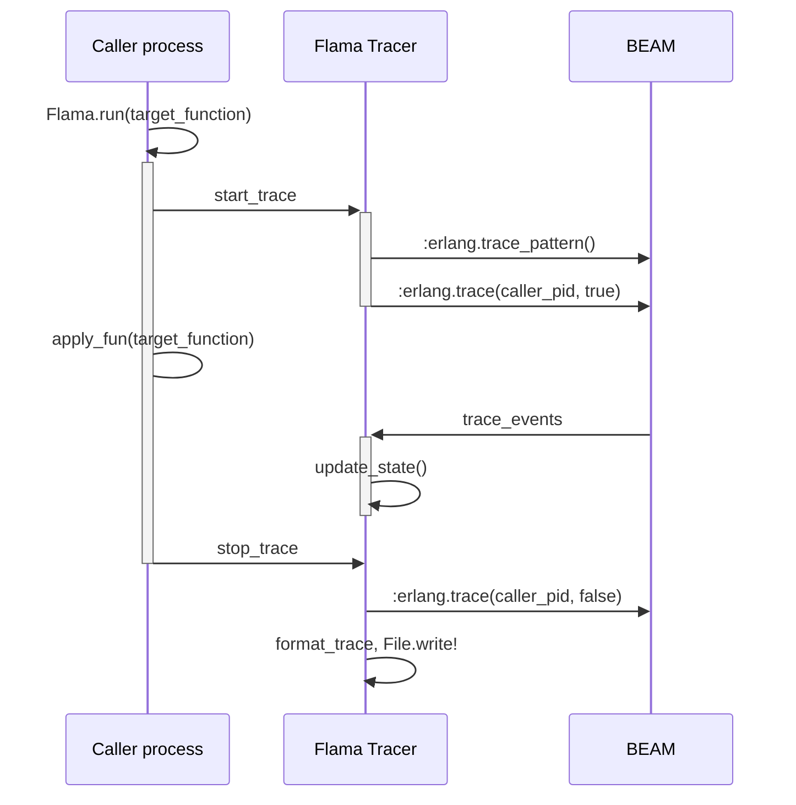
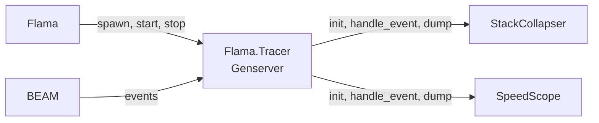

# Flama

An elixir tracer that produces flamegraph-friendly outputs. Inspired in [eflame](https://github.com/proger/eflame), a tracer for erlang. Uses [`:erlang.trace/3`](https://www.erlang.org/doc/man/erlang#trace-3) to produce traces, parses them in a Genserver, outputs results to collapsed stack files.

Built for the LambdaClass Hackathon of December 2023 🎄.

## User guide

### Instalation

Pre-requisites:

- erlang OTP 26.
- elixir 1.16.
- Alternatively: erlang and elixir may be installed using asdf (`.tool-versions` file provided so that `asdf install` can be run easily).

To install the elixir dependencies, run:

```bash
mix deps.get
```

### Tests

Tests can be run with:

```bash
mix test
```

They currently feature a simple example of stream processing.

### Usage

In elixir, if we want to produce a flamegraph for the execution of the function `my_function(arg1, arg2)`, we need to run:

```elixir
Flama.run({&my_function/2, [arg1, arg2]})
```

Additionally, if the function is in a different module, this can be specified as:

```elixir
Flama.run({SomeModule, :my_function, [arg1, arg2]})
```

### Results

Results are produced by default in a `stacks.out` file. Each line contains the PID where the function is executed, a call stack and an amount of time. This format is compatible with tools such as Brendan Gregg's [FlameGraph](https://github.com/brendangregg/FlameGraph?tab=readme-ov-file#2-fold-stacks), specifically, the script [flamegraph.pl](https://github.com/brendangregg/FlameGraph/blob/master/flamegraph.pl). If you have that script locally, you can just execute the following line:

```bash
# Give exec access to the script. This only needs to be executed once.
chmod +x flamegraph.pl 

# Produce an svg out of the trace file.
./flamegraph.pl stacks.out > flamegraph.svg
```

The resulting svg can be opened in an internet browser like Google Chrome, for interactive exploring (e.g. hovering over the a function call in a stack displays its full name).

## Architecture and design



A simple call to `Flama.run` will:

1. Spawn a Tracer process.
2. Activate BEAM tracing.
3. Execute the function to be traced in the caller's process.
4. Each message sent by BEAM tracing will be received by the tracer process, which will save the stack tree in its internal state (more details later).

When the function finishes, then:

1. BEAM tracing will be stopped.
2. A call to the Tracer process will be sent to write the results to a file.
3. After this finishes (or there's a timeout) the Tracer process will be stopped.

A timeout will mean that the Tracer GenServer did not finish processing the trace messages in a reasonable amount of time after the call to stop happened. This usually happens when the amount of events to process was very high and stacks very deep. Consider increasing the timeout if that happens.

### How do we represent a flamegraph?

The most typical use case is to build a flamegraph for a simple function call. Let's use this example:

```elixir
defmodule M do
  def eval_polinomial(coefs, x), do: eval_polinomial(coefs, x, 0, 0)
  def eval_polinomial([], _x, _i, acc), do: acc

  def eval_polinomial([c | other_coefs], x, i, acc) do
    eval_polinomial(other_coefs, x, i + 1, acc + c * x ** i)
  end

  def do_something_else(0), do: 0
  def do_something_else(n), do: do_something_else(n - 1)
end

defmodule Example do
  def p(x) do
    M.eval_polinomial([10, 4, 7, 3], x)
  end
end

Flama.run({Example, :p, [10]})
```

Conceptually speaking, what p does is compute a polinomial. For a certain x, it returns $10+4x+7x^2+3x^3$. But regarding execution:

1. We call `Flama.run`.
2. `Flama.run`, internally, calls `apply_fun`.
3. `apply_fun` calls `Example.p(10)`.
4. `Example.p(10)` calls `M.eval_polinomial([10,4,7,3], 10)`.
5. That function is just a helper for the tail recursive function `M.eval_polinomial([10,4,7,3], 10, 0, 0)`, where the last two values are accumulators.
6. The tail recursive function calls itself a bunch of times, eventually returning to the root function, which is `Example.p`.

A simple flamegraph would contain all of this calls in order:

- `Flama.run` at the base
- `apply_fun`
- `Example.p/1`
- `M.eval_polinomial/2`
- `M.eval_polinomial/4`
- `Kernel.integer_pow/2` (exponentiation)

This is a simple stack, as each function anly calls one other function. If instead we did something like this:

```elixir
def p(x) do
    n = M.eval_polinomial([10, 4, 7, 3], x)
    M.do_something_else(100) # This is just 100 empty calls, to take some time.
    n
end
```

Then our stack, after returning from `M.eval_polinomial` would build:

- `Flama.run` at the base
- `apply_fun`
- `Example.p/1`
- `do_something_else/1`

To build this, our tracer will maintain, at all times, two important things:

- The current stack.
- The stack tree, each call with the accumulated timestamp.
- The last timestamp we got, so that we can compare in each event and calculate how much time has passed.

### Trace events explained by example

Trace events arrive to the tracer in tuples of the following shape:

```elixir
{:trace_ts, pid, :call, called_mfa, {:cp, caller_mfa}, timestamp_nanoseconds}
```

where `mfa` is a tuple of three elements: `{module, function, arity}`, which is a unique identifier of a function. Our example in the previous section, when being traced, yields the following event mfas:

| caller             | called                     |
| ------------------ | -------------------------- |
| `{Flama, :run, 2}` | `{Flama, :apply_fun, 2}`   |
| `{Flama, :run, 2}` | `{Example, :p, 1}`         |
| `{Flama, :run, 2}` | `{M, :eval_polinomial, 2}` |
| `{Flama, :run, 2}` | `{M, :eval_polinomial, 4}` |


Up to this point, the caller remains in the `run` function. This happens because the `caller_mfa` is not the immediate caller, but the function we will return to once the current call is finished. This is important, as tail calls are functions that call another function as the absolute last thing they do. As such, they are subject to TCO (tail call optimization), meaning their stack frame is deleted when doing the call. This is reflected in the examples, as `apply_fun/2`, `Example.p/1`, `eval_polinomial/2`, all perform tail calls. 

However, `:eval_polinomial/4` calls the exponentiation in a simple call, as its return value will be used for the recursive call. That means that we have the following sequence:

- Call from `{M, :eval_polinomial, 4}` to `{Kernel, :**, 2}`.
- Return to `{M, :eval_polinomial, 4}`.

In this case, we clearly see the `M.eval_polinomial/4` function being the caller and then a return event going in that direction.

We then see the last three events (call to `eval_polinomial` from `run`, call to exponentiation, return to eval_polinomial) repeated many times, before finally returning to the `run` function in the last recursive call.

### How do we update our stack according to events?

TCO is extremely useful for saving memory but it also deletes valuable information from the stack. Usually, we care about who actually called who to be able to debug. For this reason, we need to keep track of the unoptimized stack ourselves, and keep a stack tree to write the flamegraph.

Let's say a `call` happened. Depending on our internal state and the event itself, we will update it differently:

- If our stack is empty, our new stack will be `[callee, caller]`. This is our initialization.
- If the caller and callee are the same, then it's a recursive call, so we don't update the state at all.
- If the caller is the head of our stack, we're in a simple call, so we just add the `callee` to the stack.
- The main complex case comes when the caller is NOT the head of the stack. That means that there was a TCO like we described in the previous section. In turn, that means the caller (as described by the event) is buried in the stack and we don't know for sure which function between the head and the event caller is the actual caller. For this reason, we just remove elements from the stack until we reach that caller, and add the callee as per the previous case.

Other events are:

- `return_to`: we remove the head of the stack, as we returned from the function to the caller. If the member beneath the head is not the caller, for now, we ignore the event, although this edge case needs further review.
- `out`: the scheduler decides to stop the process from running. We add `:sleep` as a marker for this in the stack.
- `in`: the scheduler decides it's this pid's turn to run again, so we remove the `:sleep` marker from the stack.

### Different backends

Flama supports different output formats (svg or speedscope). To this end, the Flama GenServer delegates both the state representation, the state processing and the file output to backend modules:



By default, the `StackCollapser` module is used, but the `SpeedScope` one can be configured by adding `backend: Speedscope` to the `Flama.run` options.
